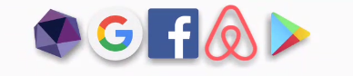
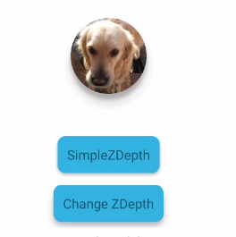
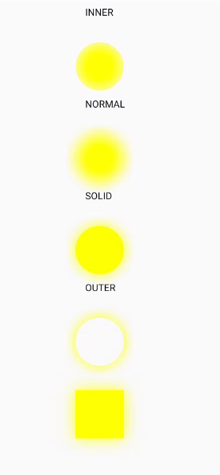
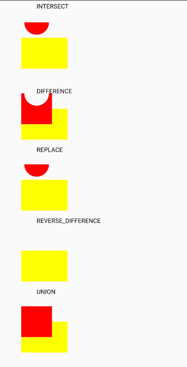

>在开发过程中经常会遇到有阴影效果的需求，实现方案有Sdk suppot的CardView，仅支持sdk>=21的android:elevation和outline，.9图设置为背景。大多数是有局限性的，如不能设置阴影颜色，不能设置阴影角度，动态阴影深度，也不能实现特殊形状的阴影，不能实现剪裁为特定形状的阴影。在开发中如果遇到原始图片是正方形，想显示为圆形并出现圆形阴影，或者图片是个正六边形，实现正六边形阴影。
原始布局是方形，实现剪裁为一边为圆弧性并实现阴影效果。现在给大家推荐一个强大阴影库，以上都能实现。https://github.com/ytjojo/ShadowLayout。功能介绍如下：
### 控件功能简介
1. 可以在xml或者代码设置阴影方向，阴影深度，阴影颜色。
2. 不管原始是什么形状都可以剪裁为圆角矩形或者圆形并带阴影。（当然你可以不设置阴影，当做一个圆形或者圆角矩形控件使用）。
3. 如果原始图片不是规则图形你可以设置自适应模式，在原始图片边框处出现阴影。
4. 可以给文字设置阴影效果。
5. 设置一个封闭path，剪裁出path并在在path边框外部出现阴影。
### 如何引入
```
apply plugin: 'com.android.application'

repositories {
    jcenter()
    mavenCentral()
}

android {
    // something code...
}

dependencies {
    compile 'com.github.ytjojo:ShadowLayout:1.0.1'
}
```

### 效果图与设置代码
如图


实现代码

```xml
 <com.ytjojo.shadowlayout.ShadowLayout
            android:id="@+id/sl_goAngleActivity"
            android:layout_width="wrap_content"
            android:layout_height="wrap_content"
            android:visibility="visible"
            app:sl_shadow_angle="45"
            app:sl_shadow_color="#9e222222"
            app:sl_shadow_distance="4dp"
            app:sl_shadow_radius="4dp">

            <TextView
                android:layout_width="wrap_content"
                android:layout_height="wrap_content"
                android:text="AutoShap UseAngle"
                android:textColor="#414141"
                android:textSize="18sp"
                android:textStyle="bold"
                android:typeface="sans" />

        </com.ytjojo.shadowlayout.ShadowLayout>
```



应用logo实现代码

```xml
 <com.ytjojo.shadowlayout.ShadowLayout
            android:layout_width="wrap_content"
            android:layout_gravity="center"
            android:layout_height="wrap_content"
            app:sl_shadow_color="#83111111"
            app:sl_shadow_offsetdx="0dp"
            app:sl_shadow_offsetdy="4dp"
            app:sl_shadow_radius="6dp"
            app:sl_shadow_zoomdy="-2dp">
            <LinearLayout
                android:gravity="center"
                android:orientation="horizontal"
                android:layout_width="wrap_content"
                android:layout_height="wrap_content">
                <ImageView
                    android:layout_width="60dp"
                    android:layout_height="60dp"
                    android:layout_gravity="center"
                    android:scaleType="centerCrop"
                    android:src="@drawable/poly" />
                <ImageView
                    android:layout_width="60dp"
                    android:layout_height="60dp"
                    android:layout_gravity="center"
                    android:scaleType="centerCrop"
                    android:src="@drawable/google" />
                <ImageView
                    android:layout_width="60dp"
                    android:layout_height="60dp"
                    android:layout_gravity="center"
                    android:scaleType="centerCrop"
                    android:src="@drawable/facebook" />
                <ImageView
                    android:layout_width="60dp"
                    android:layout_height="60dp"
                    android:layout_gravity="center"
                    android:scaleType="centerCrop"
                    android:src="@drawable/airbnb" />
                <ImageView
                    android:layout_width="60dp"
                    android:layout_height="60dp"
                    android:layout_gravity="center"
                    android:scaleType="centerCrop"
                    android:src="@drawable/playstore" />
            </LinearLayout>

        </com.ytjojo.shadowlayout.ShadowLayout>

```

这个原始图片是长方形，效果图是剪裁为下方是弧形，弧形实现原理是三阶贝尔曲线。


实现代码

```xml
<com.ytjojo.shadowlayout.ShadowLayout
    app:sl_shadow_model="shadowPath"
    app:shadow_path_coordinatex1="0.3"
    app:shadow_path_coordinatey1="0.9"
    app:shadow_path_coordinatex2="0.7"
    app:shadow_path_coordinatey2="0.9"
    app:shadow_path_startleft_y_rate="0.7"
    app:shadow_path_endright_y_rate="0.7"
    app:sl_shadow_offsetdy="1dp"
    android:layout_width="match_parent"
    android:layout_height="200dp">
    <ImageView
        android:src="@drawable/fengjing"
        android:scaleType="centerCrop"
        android:layout_width="match_parent"
        android:layout_height="wrap_content" />
</com.ytjojo.shadowlayout.ShadowLayout>
```

下图原始狗狗头像是方形的，实现效果图圆形并有阴影效果
两个按钮控件效果是圆角带阴影的，由于截图的原因阴影颜色不是很深



狗狗头像设置的代码
```xml
 <com.ytjojo.shadowlayout.ShadowLayout
                android:id="@+id/ovalShapeSl"
                android:layout_width="wrap_content"
                android:layout_height="wrap_content"
                android:visibility="visible"
                app:sl_shadow_model="shadowShape"
                app:z_depth="z_depth3"
                app:z_depth_clipcanvas="true"
                app:z_depth_shape="oval">

                <ImageView
                    android:layout_width="80dp"
                    android:layout_height="80dp"
                    android:scaleType="centerCrop"
                    android:src="@drawable/quila" />
            </com.ytjojo.shadowlayout.ShadowLayout>
```

两个圆角应用按钮效果实现代码

```xml

            <com.ytjojo.shadowlayout.ShadowLayout

                android:layout_width="wrap_content"
                android:layout_height="wrap_content"
                android:visibility="visible"
                app:sl_shadow_model="shadowShape"
                app:sl_shadow_rectroundradius="8dp"
                app:z_depth="z_depth2"
                app:z_depth_padding="z_depth2"
                app:z_depth_clipcanvas="true"
                app:z_depth_shape="rect">

                <TextView
                    android:id="@+id/tv_Simplezdepth"
                    android:layout_width="wrap_content"
                    android:layout_height="wrap_content"
                    android:background="#31B4E1"
                    android:padding="10dp"
                    android:text="SimpleZDepth" />
            </com.ytjojo.shadowlayout.ShadowLayout>

            <com.ytjojo.shadowlayout.ShadowLayout
                android:layout_width="wrap_content"
                android:layout_height="wrap_content"
                android:visibility="visible"
                app:sl_shadow_model="shadowShape"
                app:sl_shadow_rectroundradius="8dp"
                app:z_depth="z_depth3"
                app:z_depth_padding="z_depth2"
                app:z_depth_clipcanvas="true"
                app:z_depth_shape="rect">

                <TextView
                    android:id="@+id/tv_Changezdepth"
                    android:layout_width="wrap_content"
                    android:layout_height="wrap_content"
                    android:background="#31B4E1"
                    android:padding="10dp"
                    android:text="Change ZDepth" />
            </com.ytjojo.shadowlayout.ShadowLayout>
```

### 阴影原理简介
绘制阴影的原理其实很简单，画笔对象设置BlurMaskFilter,
`mPaint.setMaskFilter(new BlurMaskFilter(mShadowRadius, BlurMaskFilter.Blur.NORMAL));`
先看下BlurMaskFilter构造函数
>BlurMaskFilter(float radius, BlurMaskFilter.Blur style)

radius的值为阴影扩散的距离，BlurMaskFilter.Blur是个枚举值，有四个，SOLID，NORMAL,OUTER，INNER。
我们写个BlurMaskFilterView来看看四个值分别是什么效果
代码很简单绘制一个圆形之前设置BlurMaskFilter
```java
     mPaint.setMaskFilter(new BlurMaskFilter(mBlurRadus,style));
        canvas.drawCircle(0,0,mCircleRadus,mPaint);
```
但是运行起来之后却没有阴影效果，纳尼？
突然想起来，这个方法是不支持硬件加速的，在view的构造方法加上禁用硬件加速，代码如下
```java
  setLayerType(LAYER_TYPE_SOFTWARE, null);
```
运行效果如图



Inner 阴影在圆形的内部，有种淡淡的浮雕感。
NORMAL是对整个区域产出模糊
SOLD是对透明区域边缘产出模糊，区域内不会模糊
OUTER是对整个边缘产生模糊，同时区域内变为透明
图中方形用的SOLD模式
本项目中用的是NORMAL模式，阴影效果最好

### 图片阴影效果
库中的绘制图片阴影效果在AutoModel.java 的onDraw方法中，源码大致流程是先初始化布局同等大小的
Canvas和bitmap对象，将创建的canvas对象作为入参，调用view的dispatchDraw方法将布局的图像保存在自己创建的画布，再从画布中获得bitmap对象，调用mBitmap.extractAlpha()方法获得一个Alpha通道图
用设置BlurMaskFilter的画笔对象将alpha通道图绘制到系统的canvas对象上，作为底图，然后调用ShadowLayout的super.dispatchDraw绘制原本要绘制的内容。总结来说就是多画了有边界模糊效果的底图，在绘制目标图片，形成叠加效果。
代码如下

```java
 @Override
    public void onDraw(final Canvas canvas) {
        // If is not shadowed, skip
        if (mIsShadowed) {
            // If need to redraw shadow
            if (mInvalidateShadow) {
                // If bounds is zero
                if (mBounds.width() != 0 && mBounds.height() != 0) {
                    // Reset bitmap to bounds
					//创建一个和布局一样大小的Bitmap
                    mBitmap = Bitmap.createBitmap(
                            mBounds.width(), mBounds.height(), Bitmap.Config.ARGB_8888
                    );
                    // Canvas reset
					//把bitma设置进自己创建的画布上，注意哦，这是自己创建的画布
					//不是系统在dispatchDraw传递给我们的
                    mCanvas.setBitmap(mBitmap);

                    // We just redraw
                    mInvalidateShadow = false;
                    // Main feature of this lib. We create the local copy of all content, so now
                    // we can draw bitmap as a bottom layer of natural canvas.
                    // We draw shadow like blur effect on bitmap, cause of setShadowLayer() method of
                    // paint does`t draw shadow, it draw another copy of bitmap
					//这一步很关键，获得原始图片，子布局需要显示的元素都在bitmap里了
                    mParent.superdispatchDraw(mCanvas);

                    // Get the alpha bounds of bitmap
					//获得alpha通道的bitmap，不能用原始图片哦
                    Bitmap extractedAlpha = mBitmap.extractAlpha();
                    // Clear past content content to draw shadow
                    mCanvas.drawColor(0, PorterDuff.Mode.CLEAR);

                    // Draw extracted alpha bounds of our local canvas
                    mPaint.setColor(adjustShadowAlpha(false));
                    if(mZoomDy !=0f && mZoomDy != Integer.MAX_VALUE){
                        extractedAlpha = getScaleBitmap(extractedAlpha,mZoomDy);
                    }
                    if(mDrawCenter){
                        final int w=  extractedAlpha.getWidth();
                        final int h =  extractedAlpha.getHeight();
                        float l = (mCanvas.getWidth()-w)/2+(mOffsetDx==Integer.MAX_VALUE?0:mOffsetDx);
                        float t = (mCanvas.getHeight()-h)/2 +(mOffsetDy==Integer.MAX_VALUE?0:mOffsetDy);
                        mCanvas.drawBitmap(extractedAlpha, l, t, mPaint);
                    }else{
                        mCanvas.drawBitmap(extractedAlpha, mOffsetDx==Integer.MAX_VALUE?0:mOffsetDx, mOffsetDy==Integer.MAX_VALUE?0:mOffsetDy, mPaint);

                    }

                    // Recycle and clear extracted alpha
                    extractedAlpha.recycle();
                } else {
                    // Create placeholder bitmap when size is zero and wait until new size coming up
                    mBitmap = Bitmap.createBitmap(1, 1, Bitmap.Config.RGB_565);
                }
            }

            // Reset alpha to draw child with full alpha
            mPaint.setColor(adjustShadowAlpha(true));
            // Draw shadow bitmap
			//绘制带阴影的底图
            if (mCanvas != null && mBitmap != null && !mBitmap.isRecycled())
                canvas.drawBitmap(mBitmap, 0.0F, 0.0F, mPaint);
        }

        // Draw child`s
		//绘制原始的元素，
        mParent.superdispatchDraw(mCanvas);
    }

```

### 绘制区域的剪切
关于canvas剪裁推荐三篇篇文章
http://blog.csdn.net/richiezhu/article/details/52956163
http://blog.csdn.net/oney139/article/details/8177599
http://blog.csdn.net/cquwentao/article/details/51365099
canvas剪裁最重要的是Region.Op这个参数，这个枚举有6个值。    DIFFERENCE,INTERSECT,UNION，XOR，REVERSE_DIFFERENCE， REPLACE，先写个demo看看每个值的效果吧
ClipView.java
```java
    canvas.save();
        canvas.translate(x,y);
        mPaint.setColor(Color.YELLOW);
		//代码先绘制了黄色矩形
        canvas.drawRect(-100,100,200,300,mPaint);
		//设置了一个圆形封闭path
        mPath.addCircle(0,0,80, Path.Direction.CCW);
		//画布根据path进行剪裁
        canvas.clipPath(mPath, Region.Op.INTERSECT);

        mPaint.setColor(Color.RED);
		//绘制一个红色正方形
        canvas.drawRect(-100,0,100,200,mPaint);
        canvas.restore();
```

只贴了INTERSECT类型的代码其他类型代码大同小异，这里就不贴了.代码中，先绘制黄色矩形，剪裁圆形，绘制红色方形


通过效果图得知，剪裁之前绘制的图像不受剪裁影响
>DIFFERENCE(0), //取补集   
INTERSECT(1), // 交集   
UNION(2),      //并集    
XOR(3),        //异并集    
REVERSE_DIFFERENCE(4), //反转补集    
REPLACE(5); //后者区域替代前者  

### 剪裁子View

重写`1drawChild(Canvas canvas, View child, long drawingTime) `
```java
@Override
    protected boolean drawChild(Canvas canvas, View child, long drawingTime) {
        try {
            canvas.save();
            return mShadowDeltegate.onClipCanvas(canvas,child)&super.drawChild(canvas, child, drawingTime);
        }finally {
            canvas.restore();
        }
    }
```
PathModel中onClipCanvas代码如下
直接设置剪裁path，最终绘制的子View就是想要形状
```java
    @Override
    public boolean onClipCanvas(Canvas canvas, View child) {

        canvas.clipPath(mClipPath);
        if (Build.VERSION.SDK_INT >= Build.VERSION_CODES.LOLLIPOP) {
            child.invalidateOutline();
        }
        return false;
    }
```
### 根据path绘制阴影

```java

 @Override
    public void onDrawOver(Canvas canvas) {
        canvas.save();
//        if(Build.VERSION.SDK_INT>=19){
//            canvas.clipPath(mPath);
//        }else{
//            canvas.clipPath(mPath, Region.Op.REPLACE);
//            canvas.clipPath(mClipPath, Region.Op.DIFFERENCE);
//        }
        canvas.clipPath(mPath, Region.Op.REPLACE);
        canvas.clipPath(mClipPath, Region.Op.DIFFERENCE);
        mPaint.setColor(Color.BLACK);
        mShadowpath.set(mClipPath);
        mShadowpath.offset(mOffsetDx, mOffsetDy);
        canvas.drawPath(mShadowpath, mPaint);
        canvas.restore();

    }
```
mPath是ShadowLayout的整个区域。
mClipPath 有两个来源一个是根据xml中用户配置的控制点生成的path。
另外一种用户调用public void setPath(Path path)来设置的path。
mShadowpath是mClipPath的copy，再加上一定的x轴y轴的偏移。
```java
canvas.clipPath(mPath, Region.Op.REPLACE);
canvas.clipPath(mClipPath, Region.Op.DIFFERENCE);
```
这两句的意思是剪裁出当前布局除剪裁区域以外的所有区域，相当于剪裁区域的取反，但不超出当前布局。
`canvas.drawPath(mShadowpath, mPaint);`这句功能是在剪裁区域外绘制阴影，最终效果是剪裁区域+阴影区域，效果上面已给出。
### 完结
大体上原理都已经说明，用到技术也不是很深，简单总结下，如有纰漏欢迎指出，如果喜欢本库，欢迎star下，鼓励下作者。


